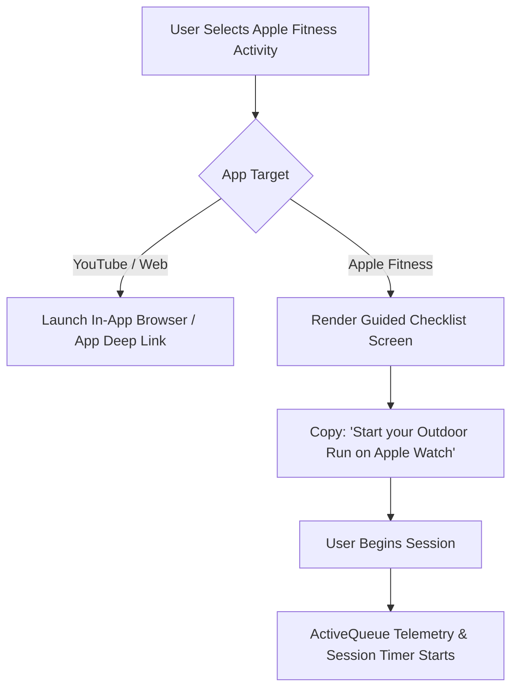

# Spike Report: Apple Fitness Deep Linking & URL Scheme Verification

**Task ID:** [`86bbb1epm`](https://app.clickup.com/t/86bbb1epm)  
**Parent Task:** Milestone 2 ([`86bbautb9`](https://app.clickup.com/t/86bbautb9))  
**Date:** 2026-08-09  
**Status:** COMPLETE (Fallback Architecture Confirmed)

---

## 1. Executive Summary

A spike investigation was conducted per **SPEC §6.3** and **Risk #2** to determine whether Apple Fitness (`Fitness.app` / `Activity.app` on iOS) exposes a usable, public deep-linking URL scheme (e.g., `fitness://` or `fitnessapp://`) for launching specific workout types directly from third-party applications.

### Key Finding
**Apple Fitness has no publicly documented or supported URL scheme.** Apple restricts workout session initialization to `HealthKit` (`HKWorkoutSession`) APIs or manual user initiation on an Apple Watch / iPhone.

### Architectural Decision
1. **Fallback Behavior Only**: ActiveQueue will ship `apple_fitness` tracker support with **fallback guidance only** (presenting clear UI copy instructing the user to start their workout session directly from their Apple Watch or Apple Fitness app).
2. **No Unverified Scheme Dependency**: No shipped frontend or backend code in ActiveQueue will rely on or attempt to trigger unverified deep links (`fitness://`, `activity://`, `fit://`).
3. **Impact on Milestone 3**: Milestone 3 session orchestrator and activity launcher screens will render guided checklist copy for Apple Fitness instead of automated deep-link navigation buttons.

---

## 2. Technical Investigation & iOS Capabilities

### A. URL Scheme Analysis
- **Attempted / Researched Schemes**:
  - `fitness://` — Not registered by Apple iOS system apps.
  - `fitnessapp://` — Not registered by Apple.
  - `activity://` — Private internal scheme used by Fitness app for shared activity links, non-functional for third-party launch.
  - `x-apple-health://` — Opens the Apple Health app, but cannot launch specific workout sessions or navigate into Apple Fitness+.

### B. Apple Developer Sandbox & HealthKit Constraints
- **HealthKit (`HKWorkoutSession`)**:
  - `HKWorkoutSession` allows watchOS apps to track workout metrics (heart rate, active calories, distance).
  - However, third-party iOS apps cannot programmatically launch Apple Fitness+ video content or trigger system workout timers via URL schemes.
- **Universal Links**:
  - Apple Fitness+ content links (`fitness.apple.com/us/workout/...`) open within the Apple Fitness app on iOS 14.5+ if subscribed, but require an active Apple Fitness+ subscription and do not provide standard workout session telemetry callbacks to third-party apps.

---

## 3. Recommended Fallback Architecture (SPEC §6.3 Compliance)

To ensure high UX clarity without risking system crashes or broken deep links:

### UI Copy Specification for Apple Fitness Activities
- **Header**: "Apple Fitness Activity"
- **Instruction**: *"Start your workout tracking on your Apple Watch or Fitness app, then tap Start Session below to begin your ActiveQueue time-box."*
- **Action Button**: Primary `Start Session` button (controls ActiveQueue session timer without attempting external app deep links).

---

## 4. Verification & Next Steps

- [x] Documented Apple Fitness URL scheme limitations and iOS platform boundaries.
- [x] Confirmed zero dependency on unverified deep-link schemes across codebase.
- [x] Aligned Milestone 3 activity launcher specification with guided checklist fallback behavior.
